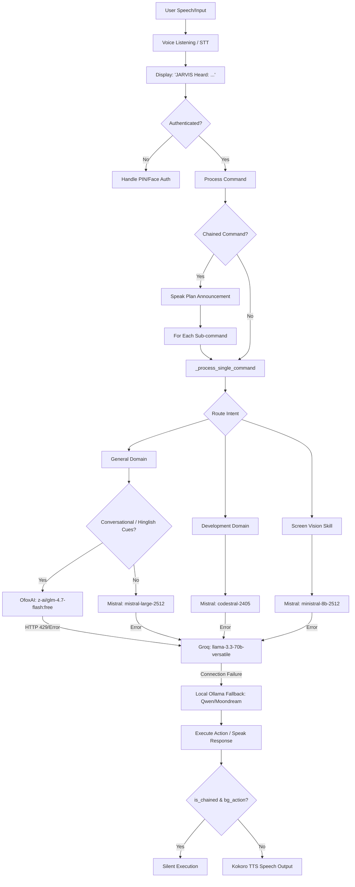

# 🎙️ JARVIS: AI Voice Assistant with Gesture Control

[](LICENSE)
[](https://www.python.org/)
[](https://ollama.com/)
[](https://github.com/hexgrad/kokoro)
[](https://github.com/darshitp091/Jarvis)
[](https://github.com/darshitp091/Jarvis)

JARVIS is an open-source **AI voice assistant** and **gesture control assistant** built for local, privacy-first **desktop automation** and hands-free control. Operating on a hybrid local-and-cloud architecture, it combines local neural **text-to-speech** (TTS) synthesis, real-time spatial **computer vision** (webcam hand gestures & eye-gaze tracking), local offline **speech-to-text** (STT), and an advanced LLM fallback router.

As a complete **hands-free computer controller**, JARVIS executes complex operating system commands, runs concurrent multi-engine web searches, automates file scripts, performs facial vitals (heart rate rPPG) diagnostics, and directs Android devices via a local USB ADB mobile bridge.

---

### 📊 Repository Status & Activity
<p align="center">
  
  
</p>

---

## 🚀 The Journey of JARVIS

JARVIS grew from a simple voice-controlled CLI script into a fully integrated spatial-perception OS controller. 

*   **Phase 1: Basic Speech & Router Foundation:** Built standard voice recognition and text-to-speech loops. Implemented semantic routing regexes to map commands (like volume or brightness changes) to local scripts.
*   **Phase 2: Spatial Perception & Gesture Control:** Integrated MediaPipe hand tracking to convert the user's hand into a mouse cursor. Added custom features like **Air Writing** (drawing neon trails on screen) and fist-activated window closures (with self-closure guards to prevent JARVIS from terminating itself).
*   **Phase 3: Stark-Level Desktop Utilities:** Added custom transparent PyQt6 overlays for system tools including an eye-care amber night-light overlay, a pixel-accurate screen ruler, and a click-and-drag snipping tool. Added real-time screen recording (OpenCV) and watermarked screenshotting.
*   **Phase 4: Productivity & Analytics Engines:** Added support for local databases (Todo, KPIs, Contacts) using SQLite, Excel/CSV ingestion, Matplotlib plotting, SMTP/IMAP email dispatcher, and automated Mutual NDA/document generators.
*   **Phase 5: Mobile Control via ADB:** Built a phone integration interface that executes ADB commands over USB. It handles 45 different phone interactions (dialing, messaging, maps navigation, system settings) completely offline, securing user privacy.
*   **Phase 6: Cloud Brain & Resilient Routing (Latest):** Migrated the main reasoning brain, screen vision, and software engineering domains to high-speed cloud APIs (Mistral Large, Codestral, OfoxAI GLM) via a unified fallback router. Added character-by-character response streaming, plain-text conversational synthesis filters, transcription feedback display, and duplicate verbal suppression.

---

## 🛠️ AI Assistant Core Capabilities & Features

### 1. 🗣️ Voice, Speech, & Audio
*   **"JARVIS Heard" Feedback:** Displays direct console logging and stdout prints `JARVIS Heard: <transcribed text>` on transcription to provide instant visual feedback.
*   **Multilingual STT:** Transcribes **English, Hindi, and Gujarati** commands using a local `Faster-Whisper` model.
*   **Neural Speech Synthesis:** Speaks in a natural, witty British accent utilizing a local **Kokoro ONNX** engine.
*   **Acoustic Interruption:** Automatically stops speaking mid-sentence if you interrupt by talking over it (uses a persistent microphone feedback analyzer thread).
*   **Whisper Mode:** Speech volume scales down to 25% and speed drops to 0.8x for quiet/private interactions.

### 2. 🖐️ High-Fidelity Hand Gesture Control
Activate spatial control using your webcam feed (runs smoothly at ~30 FPS):
*   **Cursor Tracking:** Tracks your index finger with Exponential Moving Average (EMA) smoothing to eliminate hand jitters.
*   **Left Click & Drag:** Pinch Index + Thumb. Holds drag states for text highlighting or window dragging.
*   **Right Click / Double Click:** Pinch Middle + Thumb (Right Click) or Pinky + Thumb (Double Click).
*   **Scrolling:** Extend Index + Middle + Ring fingers and move vertically.
*   **Air Writing Canvas:** Extend Index + Pinky ("Rock-On") to draw neon-green trails on screen.
*   **Window Management:** Holds the window under the cursor (Index + Middle extended) to move it. Close active windows by forming a Closed Fist (held for 1.5s).

### 3. 👁️ Eye-Gaze & Fatigue Monitoring
*   **Proactive Alerts:** Measures eyebrow furrowing and eye-gaze centering via a local camera mesh. If you appear confused or furrow your brow for over 30 seconds, JARVIS prompts: *"Sir, you look a bit puzzled. Would you like me to analyze your active window or screen code?"*
*   **Sentry Mode:** Lock screen automatically if unauthorized face peekers are detected behind you, or if owner presence is lost.

### 4. 📊 Data Ingestion & Analytics
*   **File Parsers:** Directly reads and summarizes Excel (`.xlsx`), CSV, Word (`.docx`), and PDF files from disk.
*   **Local Plotting:** Generates and exports custom trend charts and scatter plots to `config/chart.png` using Matplotlib.
*   **Telemetry KPI Logs:** Tracks custom numerical performance data inside a local SQLite database (`kpis.db`).

### 5. 🌐 Offline & Parallel Web Research
*   **Concurrent Multi-Engine Search:** Queries Google, DuckDuckGo, Bing, and Yahoo concurrently. Merges unique links and crawl results in parallel (up to 5 concurrent tabs).
*   **Fact Checker:** Crawls search results locally, cross-examines sources, and validates facts using the LLM brain.
*   **Competitor Diff Tracker:** Monitors changes on specified websites by downloading, stripping, and diffing layouts.

### 6. 📱 Android ADB Mobile Integration
Control your phone from your PC using an offline USB ADB interface:
*   **Hardware Control:** Toggle flashlight, adjust volume/brightness streams, switch sound profiles (silent/vibrate/normal), and query battery/telemetry stats.
*   **Multimodal VLM Screen/Camera Analysis:** Captures the phone screen or camera shutter, pulls the image, and describes it via the local Moondream model.
*   **Communications:** Resolve contacts fuzzily, compose SMS drafts, and send WhatsApp messages or launch WhatsApp VoIP/Video calls.
*   **Navigation & Maps:** Query nearby stores, display coordinate pins, and launch turn-by-turn navigation intents.

### 7. 🏛️ Polyglot Software Architect & High-Level Engineer
*   **System Blueprints:** Designs production-grade software architectures, database schemas, and OOP class relationships complete with embedded, clean Mermaid.js diagrams.
*   **Optimal Code Generation:** Writes optimal, production-grade solutions and snippets in Rust, Go, C++, Zig, Python, and JavaScript/TypeScript.
*   **DSA & Quality Audits:** Scans code from files or system clipboard to check for memory leaks, concurrency bugs, algorithmic (Big O) complexity, and design pattern violations.

### 8. ⚙️ Mechanics CAD Simulator & 3D Hologram Viewport
*   **3D Geometry Blueprinting:** Mathematically designs coordinates and connections for physical mechanical assemblies:
    *   *Gear Assembly:* Axles, inner hub rims, and 12-teeth gears.
    *   *Double-Wishbone Suspension:* Upper/lower A-arms, shock coilovers, wheel spindles, and rim outlines.
    *   *Rocket Engine Nozzle:* Concentric combustor, throat narrowing, and expansion bell exit rings.
*   **Real-Time Parallax Hologram:** Projects designed meshes to the draggable, floating glassmorphic 3D Hologram viewport. Coordinates skew dynamically in 3D perspective based on face-tracking (webcam) bounding boxes or mouse movement.

### 9. 🔬 Deep Autonomous Research Explorer
*   **Multi-Stage Deep Crawls:** Dynamically generates search queries for general web search and academic literature (arXiv/Semantic Scholar style).
*   **Academic Paper Synthesis:** Crawls and compiles gathered data into publication-grade scientific reports containing Abstract, State of the Art, Mathematical Modeling (with LaTeX math equations), Hypotheses, and APA references.

### 10. 🚨 Emergency Sentry & Smart Contact Sentry
*   **Distress Triggers:** Listens for vocal panic RMS spikes (>330.0) or emergency keywords (*accident*, *injured*, *bleeding*, *heart attack*, *unconscious*).
*   **Webcam Visual Verification:** captures a camera frame and asks the vision model (`ministral-8b-2512`) to verify if there is an actual visible physical hazard, injury, fall, or fire to eliminate false alarms.
*   **Fuzzy Priority Contact Dialing:** Once verified, searches Android contacts (Ambulance, Doctor, Mom, Dad, Wife, Family) and dials via ADB bridge.

---

## 🏛️ System Architecture & Fallback Routing

JARVIS uses a dynamic routing system to direct intent commands. It evaluates user queries, matches constraints, and executes fallbacks across cloud APIs and local instances to maintain offline capability.



---

## 🤖 Local AI Model Stack & Neural Engines

JARVIS coordinates multiple specialized models running locally and in the cloud:

| Model Role | Model / Repository | Interface | Purpose |
| :--- | :--- | :---: | :--- |
| **Main Brain** | `mistral-large-2512` | Mistral API | Master conversation, reasoning, and planning. |
| **Vision (VLM)** | `ministral-8b-2512` | Mistral API | Multimodal screen descriptions and webcam analysis. |
| **Code Specialist** | `codestral-2405` | Mistral API | Coding assistant, bug checks, and environment setup. |
| **Conversational Fallback**| `z-ai/glm-4.7-flash:free`| OfoxAI API | Free general dialogue chat & Hinglish translations. |
| **Cloud Fallback** | `llama-3.3-70b-versatile` | Groq API | Backup reasoning & conversational intelligence. |
| **Local Brain** | `Qwen2.5-1.5B-Instruct` | Ollama | Local offline fallback for general queries. |
| **Local Vision** | `moondream:latest` | Ollama | Local offline fallback for screen analysis. |
| **Medical Domain** | `medgemma:latest` | Ollama | Offline medical explanations and symptoms checker. |
| **Speech-to-Text** | `Faster-Whisper` (base) | Direct Python | Fast speech-to-text with auto-language detection. |
| **Text-to-Speech** | `Kokoro-82M` (Kokoro ONNX) | Direct Python | Speech synthesis in a high-quality British voice. |
| **Sensory Tracking** | `MediaPipe` / `OpenCV` | Direct Python | Hand landmarks, Face Mesh, and face detection. |

---

## 📂 Repository Directory Structure

```
Jarvis/
├── core/                  # Core audio, routing, and verification modules
│   ├── audio_engine.py    # Whisper-based STT, feedback, acoustic interrupt
│   ├── intent_router.py   # Intent routing via regex & semantic embeddings
│   ├── voice_auth.py      # Speaker similarity check & authentication
│   └── wake_word.py       # Wake-word verification
├── domains/               # Specialized knowledge domain handlers
│   ├── business.py        # Business expert query pipeline
│   ├── development.py     # Code generation using Codestral/Codegemma
│   ├── finance.py         # Financial models query pipeline
│   ├── medical.py         # Symptoms & health query pipeline
│   ├── science.py         # Scientific research query pipeline
│   └── security.py        # Security & safety classifier pipeline
├── skills/                # Spatial perception & utility actions
│   ├── obsidian_control.py# Obsidian knowledge vault connector
│   ├── screen_vision.py   # Screen capture, OCR & Multimodal vision
│   └── web_research.py    # Concurrent search crawling (Google, DDG, Bing, Yahoo)
├── config/                # Settings & profiles
│   ├── settings.yaml      # API keys, active model configurations
│   ├── prompts.yaml       # System instructions & intent rules
│   └── voice_profile.json # Calibrated speaker mean vector & threshold
├── calibrate_voice.py     # Calibrated speaker profile recorder
├── main.py                # Main app orchestrator & Qt GUI event loop
└── requirements.txt       # Project python dependencies
```

---

## ⚙️ Installation & Setup

### Prerequisites
*   Windows 10/11
*   Python 3.10 or 3.11 (Python 3.12 is not recommended due to MediaPipe constraints)
*   [Ollama](https://ollama.com/) (installed and running in background)
*   [Tesseract OCR](https://github.com/UB-Mannheim/tesseract/wiki) (Add to system PATH for screen vision)
*   A working webcam and microphone

### Step 1: Clone the Repository
```bash
git clone https://github.com/darshitp091/Jarvis.git
cd Jarvis
```

### Step 2: Set Up Virtual Environment & Dependencies
```powershell
# Create virtual environment
python -m venv jarvis_env

# Activate virtual environment
.\jarvis_env\Scripts\Activate.ps1

# Install requirements
pip install -r requirements.txt
```

### Step 3: Install & Start Ollama Models
Ensure Ollama is running, then pull the fallback models:
```bash
ollama pull yasserrmd/Human-Like-Qwen2.5-1.5B-Instruct:latest
ollama pull moondream:latest
```

### Step 4: Download Kokoro TTS Weights
To run high-quality neural voice synthesis locally:
1. Download the ONNX model file `kokoro-v1.0.onnx` and the voices binary file `voices-v1.0.bin` (e.g. from the [hexgrad/kokoro-onnx](https://github.com/hexgrad/kokoro-onnx) releases).
2. Place both files in the root folder of the project.
```
Jarvis/
├── kokoro-v1.0.onnx
├── voices-v1.0.bin
├── main.py
...
```

### Step 5: Install MPV Player for Local Music Streaming
To stream music from YouTube in the background for free without requiring a Spotify Premium subscription:
1. Download the Windows build of **MPV** (e.g., from [mpv.io](https://mpv.io/)).
2. Create a folder named `bin` in the root of the project if it does not exist:
   ```
   Jarvis/
   ├── bin/
   │   └── mpv.exe
   ├── main.py
   ...
   ```
3. Place `mpv.exe` directly inside the `bin/` directory.

### Step 6: Configure API Keys (Optional)
Open `config/settings.yaml` and configure your API keys:
```yaml
mistral:
  api_key: "YOUR_MISTRAL_API_KEY"
ofoxai:
  api_key: "YOUR_OFOXAI_API_KEY"
groq:
  api_key: "YOUR_GROQ_API_KEY"
spotify:
  client_id: "YOUR_SPOTIFY_CLIENT_ID"
  client_secret: "YOUR_SPOTIFY_CLIENT_SECRET"
  redirect_uri: "http://127.0.0.1:8888/callback"
  api_enabled: true
```

> [!NOTE]
> **Dynamic Music Routing**: If you configure Spotify credentials and set `api_enabled` to true, JARVIS uses the Spotify Web API to stream. If credentials are left as placeholders or `api_enabled` is false, it automatically falls back to streaming local YouTube audio using `mpv.exe` in the background.

---

## ⚡ How to Run
Once configuration is complete, execute the main orchestrator:
```powershell
python main.py
```
*   Double-click the **Floating Orb UI** to open the HUD System Dashboard.
*   Say *"Hey JARVIS"* to trigger voice commands.
*   Hold up your hand to the webcam to engage mouse gesture tracking. Pinch fingers to click, scroll, and drag. Form a closed fist to close active application windows.

---

## 📄 License
This project is licensed under the MIT License - see the [LICENSE](LICENSE) file for details.
