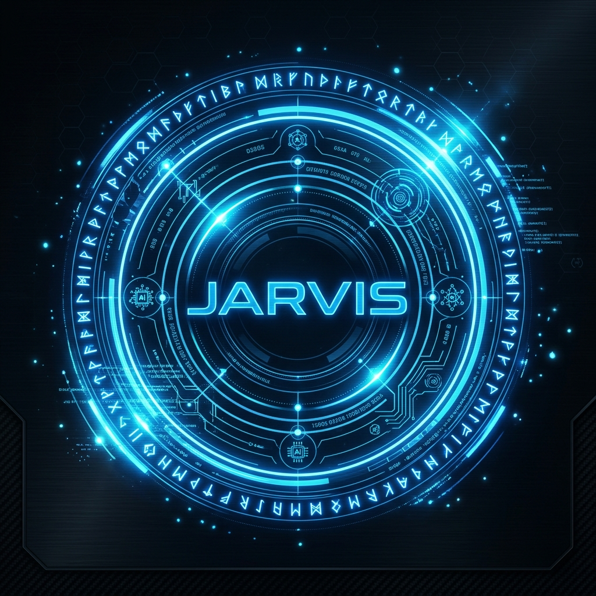
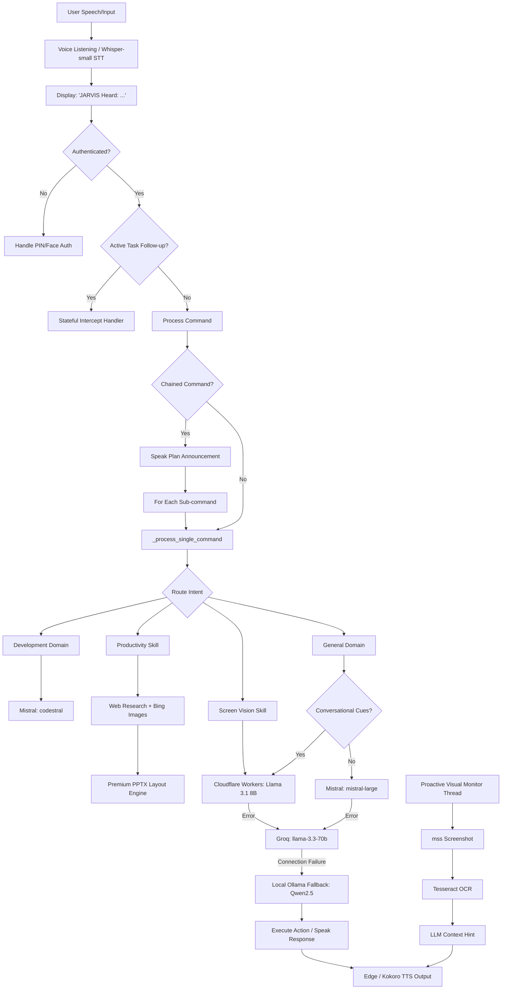

<p align="center">
  
</p>

# 🎙️ JARVIS — AI Voice Assistant & Spatial Gesture OS Controller

<p align="center">
  <strong>A high-performance, privacy-first, Stark-inspired desktop companion blending local neural pipelines, spatial computer vision, serverless LLM scaling, and a proactive visual monitor to fully automate your Windows workflow.</strong>
</p>

<p align="center">
  <a href="https://github.com/darshitp091/Jarvis/actions"></a>
  <a href="LICENSE"></a>
  <a href="https://www.python.org/"></a>
  <a href="https://ollama.com/"></a>
  <a href="https://github.com/hexgrad/kokoro"></a>
  <a href="https://github.com/darshitp091/Jarvis"></a>
</p>

---

### 📊 Project Metrics & Architecture Highlights

| Core Layer | Primary Engine | Status / Connectivity |
| :--- | :--- | :--- |
| 🧠 **Orchestrator** | PyQt6 Multi-threading | Local Event Loop |
| 🗣️ **Speech Engine** | Whisper-small (fine-tuned Hinglish) + Edge-TTS | Hybrid (Auto Fallback) |
| 🖐️ **Vision Sensor** | MediaPipe & OpenCV | Local (30 FPS Webcam Feed) |
| 👁️ **Proactive Monitor** | ScreenVision + Tesseract OCR | Background Loop (Always-On) |
| ☁️ **Serverless Router** | Cloudflare Workers (Llama 3.1 8B) | Active / Connected |
| 📂 **Workspace Database** | SQLite3 & Obsidian API | Local Vault Synchronized |
| 📊 **Presentation Engine** | python-pptx + Bing Image Scraper | Online Research + Layout |

---

## 📖 About the Project

JARVIS is an advanced **AI voice assistant** and **spatial gesture controller** engineered for privacy-first desktop automation. Operating on a hybrid local-and-cloud architecture, it combines real-time spatial computer vision (webcam hand gestures & eye-gaze tracking), bilingual Hinglish speech-to-text (powered by a locally fine-tuned Whisper-small model), a resilient serverless LLM routing brain, and a continuously running proactive screen monitor.

As a complete hands-free computer controller, JARVIS executes operating system actions, manages background media playback, runs parallel web crawler sweeps, researches topics online and compiles professional presentations, stores notes inside an Obsidian vault, and commands Android phones via an offline ADB mobile bridge — all through natural Hinglish voice commands.

---

## 🧩 What Can JARVIS Do? (Quick Reference)

> Speak naturally in **English or Hinglish** — JARVIS understands both.

### 🗣️ Voice & Speech
- 🎙️ Transcribe your speech in real-time (English, Hindi, Hinglish)
- 🔊 Speak back in a natural Indian-accented voice (Edge-TTS / Kokoro)
- 🚀 Execute **chained commands** — _"pehle yeh karo, phir woh karo"_
- 🛑 Stop speaking immediately when you interrupt it
- 🌐 Switch seamlessly between English and Hinglish mid-sentence

### 💻 Windows OS Control
- 🗂️ Open, close, move, resize, and switch between application windows
- 📋 Copy, paste, type, and control the clipboard
- 🔍 Search files and folders across your drive
- 📸 Take screenshots and screen recordings
- 🔒 Lock your PC, put it to sleep, or restart it
- ⌨️ Run any terminal/PowerShell command via voice
- 📐 Launch the screen ruler, snipper tool, and HUD overlays

### 🖐️ Gesture & Vision Control
- 🖱️ Control the mouse cursor with your index finger (webcam-only, no touch)
- 👆 Left click, right click, double click, and drag via pinch gestures
- 📜 Scroll pages up/down with multi-finger swipes
- ✍️ Draw neon air-writing trails on the screen with a Rock-On gesture
- 🪟 Swipe windows to move them; hold a fist to close an app instantly
- 👁️ Auto-detect if you look confused for 30s and offer to analyze your screen

### 📊 Presentations & Productivity
- 📝 Create a professional PowerPoint presentation on **any topic via voice**
- 🌐 Research the topic **online** before generating slides (real content, not hallucinated)
- 🖼️ Automatically download and embed **relevant images** into each slide
- 🎨 Apply premium design themes (Midnight Cyberpunk, Stark Tech, Forest Minimalist, etc.)
- 👤 Add a branded **"Presented by [Your Name]"** cover slide
- ✏️ Edit a specific slide by saying _"slide 3 ki image badlo"_ — no slide number needed, JARVIS detects it visually
- ✅ Confirm completion with _"sahi hai"_ / _"done"_ — JARVIS remembers and clears the task

### 🎵 Music & Media
- 🎶 Play any song, artist, or playlist on **Spotify** via voice
- ▶️ Stream free YouTube audio via **MPV** (no browser needed)
- ⏸️ Pause, resume, skip, and control volume hands-free
- 📻 Search and play any genre — _"lofi music laga do"_, _"EDM bajao"_

### 🔍 Research & Web
- 🌍 Search Google / DuckDuckGo / Bing for any topic
- 📰 Summarize news, articles, and web pages in Hinglish
- 💹 Get live stock/crypto prices and market trends
- 🛒 Compare products and food items with pros/cons

### 📔 Notes & Memory
- 📝 Dictate raw notes — JARVIS structures and saves them in **Obsidian** automatically
- 🧠 Remember your preferences, coding style, and past tasks across sessions
- 🗓️ Track active tasks in memory and route follow-up commands intelligently
- 🔁 Recall what it was doing after a restart using persistent state files

### 📱 Android Phone Control (via USB/ADB)
- 🔋 Check battery, toggle flashlight, adjust volume on your phone
- 📷 Take a phone screenshot and describe what's on screen
- 💬 Send SMS messages and launch WhatsApp calls via voice
- 📂 Pull photos and files from your phone to your PC

### 👁️ Proactive Screen Monitor
- 🖥️ Watch your screen in the background every ~30 seconds (always-on)
- 💡 Proactively suggest tips based on what app is open (VS Code, browser, etc.)
- 🚨 Spot error messages on-screen and offer to fix them — without being asked
- 🔐 Lock your PC if an unknown face is detected looking at your screen

### 🛠️ Developer & Self-Healing Tools
- 🧑‍💻 Ask JARVIS to write, run, or debug code in any language
- 🔧 Auto-patch itself if a module crashes — catches the traceback and fixes the code live
- 📦 Git commit, push, and manage repositories via voice
- 🔎 Audit your codebase for security vulnerabilities
- 📊 Generate charts and graphs from local data files

---

## ⚡ Core Capabilities & Features

### 1. 🗣️ Multilingual Audio & Speech (Hinglish-First)
- **Zero-Command Transcription:** Displays instant visual CLI feedback (`JARVIS Heard: <text>`).
- **Fine-Tuned Hinglish STT:** Whisper-small fine-tuned locally on the `agarwalayushi/hinglish` dataset (2,200+ hours of Hindi, English & Romanized Hinglish speech). Handles natural code-mixed Hinglish seamlessly.
- **Hybrid Hinglish Wake Engine:** Listens for natural Hinglish wake phrases (`"jarvis"`, `"jarvis bhai"`, `"sun jarvis"`, `"chalo utho jarvis"`, `"jarvis ji"`, `"hey jarvis"`). Includes interactive enrollment tool (`record_hinglish_wakeword.py`).
- **Adaptive Speaker Verification (`0.62` Threshold):** Compares owner voice MFCC profiles against enrolled profile. Features dynamic thresholding (`0.62` default, `0.55` music active) and continuous voice print adaptation.
- **6-Minute Active Wake Lock (`360s`):** Maintains active conversational state when music is paused, preventing JARVIS from prematurely falling asleep every 5 seconds.
- **ONNX Silero VAD:** Lightweight, CPU-friendly Voice Activity Detection using ONNX-exported Silero VAD — prevents false triggers and ensures clean segmentation.
- **Chained Command Splitter:** Understands multi-step Hinglish commands like _"pehle yeh karo, phir woh karo"_ and executes each sub-task in sequence.
- **Neural Speech Synthesis:** Streams natural Kokoro or Edge-TTS speech with expressive emotional tags (`[excited]`, `[thoughtful]`, `[sigh]`, `[laugh]`) to control tone, pause inflections, and rate.
- **Acoustic Interruption:** Automatically stops speaking mid-sentence when you start talking over it.

### 2. 💬 Proactive WhatsApp & Mobile Notification Engine
- **Personal Contact Filter:** Filters out group chats, corporate alerts (swiggy, bank alerts), and OTPs, notifying you only of personal contacts.
- **Real-Time Spoken Announcements:** When awake, JARVIS announces incoming personal WhatsApp messages immediately: *"Sir, Roshan ka WhatsApp message aaya hai... Kya reply bhej doon?"*
- **Quiet Asleep Queue:** When sleeping, messages queue silently in `unread_whatsapp_messages` without interrupting your sleep, announcing a subtle notice upon wake-up.
- **WhatsApp Desktop Direct Reply:** Automatically opens WhatsApp Desktop deep-links (`whatsapp://send?...`) and types your voice replies directly.

### 3. 📊 Professional Presentation Generator (Research-Driven)
- **Online Content Research:** Crawls Google/DuckDuckGo/Bing for the requested topic, summarizes research into a bilingual Hinglish LLM outline before generating any slides.
- **Intelligent Slide Layout Engine:** Generates premium side-by-side slide layouts: bullet-point text column (left) with a contextually-matched downloaded image (right). Falls back to full-width text if no image is found.
- **Bing Image Scraper:** Queries Bing Images per slide, decodes HTML entities to extract high-res image URLs, downloads and validates them with PIL before embedding.
- **Custom Themes:** Supports multiple design themes — `midnight_cyberpunk`, `stark_tech`, `light_professional`, and `forest_minimalist` — with curated color palettes and typography.
- **Branded Cover Slide:** Automatically generates a styled cover slide with title, subtitle, and "Presented by [Name]".
- **Stateful Human-in-the-Loop:** After generating the PPTX, JARVIS asks if you're happy with it. Say _"sahi hai"_ / _"done"_ → it confirms and clears the topic from active memory. Say _"slide 3 ki image badlo"_ → it vision-detects the active slide, updates only that slide, and rebuilds.
- **Vision-Based Active Slide Detection:** Uses `ScreenVision` to screenshot and OCR the currently open PowerPoint slide to determine which slide to modify — no need to say the slide number.
- **State Persistence:** Saves full presentation metadata to `config/last_presentation.json` to enable follow-up edits even after JARVIS restarts.

### 4. 👁️ Proactive Visual Assistant (Always-On Screen Monitor)
- **Continuous Background Loop:** A dedicated background thread (`_visual_assistant_loop`) captures screenshots every ~30 seconds using `mss`.
- **App-Aware Context Engine:** Identifies the active window/application and tailors its suggestions accordingly — coding tips while in VS Code, productivity hints in a browser, etc.
- **OCR Text Extraction:** Extracts on-screen text via Tesseract OCR and passes it as context to the LLM for intelligent, relevant suggestions.
- **Proactive Voice Prompts:** If JARVIS notices something interesting (error message on screen, long YouTube video paused, etc.) it proactively speaks a helpful, contextual suggestion — without being asked.
- **Non-Blocking Design:** Runs entirely on a separate daemon thread; never blocks voice listening or command execution.

### 5. 🖐️ Spatial Hand Gesture Control
Control your mouse pointer and applications hands-free via your webcam feed (~30 FPS):
- **EMA Cursor Smoothing:** Precision finger tracking with Exponential Moving Average filters to eliminate hand tremors.
- **Click & Scroll Gestures:** Pinch Index + Thumb (Left Click & Drag), Pinch Middle + Thumb (Right Click), Pinch Pinky + Thumb (Double Click), and vertical multi-finger scrolls.
- **Air Writing Canvas:** Draw neon trails directly on your screen by raising a "Rock-On" gesture.
- **Window Swiping:** Focus or move active windows, and close applications instantly by holding a closed fist for 1.5 seconds (equipped with protection guards to prevent self-closure).

### 6. 👁️ Eye-Gaze & Fatigue Diagnostics
- **Contextual Prompts:** Monitors brow furrowing and gaze centering. Prompts to analyze your active code screen if you appear confused for more than 30 seconds.
- **Sentry Lock:** Auto-locks Windows and suspends camera feed if unauthorized face-peekers are detected behind you.

### 7. 📱 Android ADB Mobile Bridge
Control your mobile phone over an offline USB ADB connection:
- **System Diagnostics:** Query battery status, toggle flashlight, adjust sound streams, and mute audio.
- **Multimodal Screen Analysis:** Take screen grabs, pull photos, and describe them utilizing local vision models.
- **Communications:** Compose SMS messages, launch WhatsApp calls, and query contacts fuzzily.

### 8. 🏛️ Smart Note-Vault & Memory
- **Conversational Vault:** Dictate raw, unstructured notes. JARVIS uses the LLM to structure, clean, and save them in Obsidian with standard frontmatter headers and descriptive titles.
- **Episodic Memory Consolidator:** A background scheduler reads raw daily logs, extracts stable user preferences and coding styles, and stores them long-term.
- **Stateful Conversation Tracking:** JARVIS tracks active tasks in memory (e.g., presentation topic, last file opened) and routes follow-up commands to the right skill automatically — no need to repeat context.

### 9. 🛠️ Codestral & LLM Self-Healing Sensory Loop
- **Active Crash Diagnostics:** Logs full stack tracebacks to `config/crash_diagnostics.json` whenever an unexpected runtime error occurs.
- **Dynamic Hotpatching:** Instantly patches missing attributes, PyAudio stream drops, and parameter mismatches without crashing the application.
- **Mistral / Codestral Diagnosis:** Calls Codestral / Mistral LLM to analyze stack traces and speak a concise Hinglish diagnosis and recovery briefing.
- **Loop-Storm Safeguard:** Monitors error rates over 30-second windows and resets sensory subsystems automatically if an error loop occurs, preventing infinite repeating speech error loops.

---

## 🏛️ System Architecture

JARVIS uses a dynamic routing system to direct intent commands. It evaluates user queries, matches constraints, and executes fallbacks across cloud APIs and local instances to maintain offline capability.



---

## 🛠️ Built With (Tech Stack)

| Category | Technology / Library | Purpose |
| :--- | :--- | :--- |
| **Core GUI & Orchestration** | Python 3.10+, PyQt6 | Interface layouts, window overlays, and event loop threads |
| **Bilingual Hinglish STT** | `faster-whisper` (whisper-small fine-tuned) | Real-time Hinglish/English/Hindi transcription with ONNX Silero VAD |
| **Neural TTS Engine** | Edge-TTS, Kokoro ONNX | Natural speech generation with Indian & British voice streams |
| **Spatial Computer Vision** | OpenCV, MediaPipe | Face tracking, eye-gaze tracking, and hand landmarks |
| **Proactive Monitor** | `mss`, Tesseract OCR | Always-on background screen capture & OCR suggestion engine |
| **Presentation Generator** | python-pptx, Bing Scraper, PIL | Online-researched, image-enriched professional PPTX creation |
| **Main LLM Brain** | Cloudflare Workers AI | Llama-3.1-8B-Instruct (sub-second low latency general router) |
| **Specialist APIs** | Mistral AI, OfoxAI, Groq | Mistral Large, Codestral (Coding & Development) |
| **Local Model Sandbox** | Ollama | Qwen2.5-Coder-7B, Moondream2 (Offline fallback) |
| **Whisper Fine-Tuning** | HuggingFace Transformers, Adafactor | Local fine-tune of Whisper-small on Hinglish dataset |
| **Mobile Integration** | Android Debug Bridge (ADB) | Offline physical device control |
| **Data & Diagnostics** | Matplotlib, SQLite3 | Local trend charting and telemetry KPI databases |

---

## ⚙️ Getting Started

### Prerequisites
- **OS:** Windows 10 / 11
- **Python:** v3.10 or v3.11 (Python 3.12 is not recommended due to MediaPipe constraints)
- **Hardware:** A functional webcam and microphone
- **Ollama:** Installed and running in the background
- **Tesseract OCR:** Installed and added to your system `PATH`

### Installation
1. **Clone the Repository:**
   ```bash
   git clone https://github.com/darshitp091/Jarvis.git
   cd Jarvis
   ```
2. **Initialize Virtual Environment:**
   ```powershell
   python -m venv jarvis_env
   .\jarvis_env\Scripts\Activate.ps1
   ```
3. **Fetch Dependencies:**
   ```powershell
   pip install -r requirements.txt
   ```

### Local Model Weights & Player Binaries
1. **Pull local Ollama Models:**
   ```bash
   ollama pull qwen2.5-coder:7b
   ollama pull moondream:latest
   ```
2. **Download MPV Player Binary (for free YouTube audio streaming):**
   - Download the Windows build from [mpv.io](https://mpv.io/).
   - Create a `bin/` folder in the project root and place `mpv.exe` inside:
     ```
     Jarvis/
     ├── bin/
     │   └── mpv.exe
     ```
3. **Setup Kokoro TTS Weights (Optional Local Fallback):**
   - Download `kokoro-v1.0.onnx` and `voices-v1.0.bin` from [hexgrad/kokoro-onnx](https://github.com/hexgrad/kokoro-onnx).
   - Place both files directly in the root directory.

4. **Fine-Tuned Whisper Hinglish STT (Optional, Recommended):**
   - A locally fine-tuned `whisper-small` model checkpoint is included in the `whisper-small-hinglish-finetuned/` directory.
   - The fine-tuning script is available at `scratch/fine_tune_whisper_hinglish.py` using the `agarwalayushi/hinglish` HuggingFace dataset.
   - If you want to re-fine-tune from scratch:
     ```powershell
     python scratch/fine_tune_whisper_hinglish.py
     ```

### Configuration
1. Open `config/settings.yaml` and configure your API credentials:
   ```yaml
   groq:
     api_key: "YOUR_GROQ_API_KEY"
   mistral:
     api_key: "YOUR_MISTRAL_API_KEY"
   cloudflare:
     enabled: true
     account_id: "YOUR_CLOUDFLARE_ACCOUNT_ID"
     api_token: "YOUR_CLOUDFLARE_API_TOKEN"
   ```
2. Configure your Obsidian vault path:
   ```yaml
   obsidian:
     vault_path: "C:\\Users\\<User>\\Documents\\Obsidian Vault"
   ```

---

## ⚡ Usage & Operational Steps

1. **Start JARVIS Orchestrator:**
   ```powershell
   python main.py
   ```
2. **Activate Voice Control:** Speak **"Hey JARVIS"** (or your customized wake word).
3. **State your request in Hinglish or English:**
   - *Presentation:* `"Quantum physics par 12 slide ka presentation banado presented by Darshit"`
   - *Chained Action:* `"Pehle Spotify mein lofi music bajao, phir quantum physics ka presentation kholo"`
   - *Follow-up:* `"Slide 5 ki image badlo"` or `"Sahi hai, done kar do"`
   - *Music:* `"Play some coding music on Spotify."`
4. **Engage Gesture Control:** Raise your hand in front of the webcam. Move your index finger to control the mouse cursor.
5. **Proactive Monitor:** JARVIS continuously watches your screen and will proactively suggest relevant tips without being asked.

---

## 📂 Project Structure

```
Jarvis/
├── core/                        # Core engine modules
│   ├── intent_router.py         # Hinglish intent router & parameter extractor
│   ├── audio_engine.py          # STT/TTS pipeline (Whisper + VAD + Edge-TTS)
│   ├── tts_engine.py            # Kokoro ONNX TTS engine
│   ├── wake_word.py             # Wake word detector
│   ├── proactive_monitor.py     # Always-on screen screenshot & suggestion loop
│   ├── brain.py                 # Memory, episodic logs & context manager
│   └── vision_engine.py         # ScreenVision OCR & active window reader
├── skills/                      # Domain skill modules
│   ├── productivity.py          # Professional Presentation Generator (PPTX)
│   ├── spotify_control.py       # Spotify API music controller
│   ├── os_control.py            # Windows OS automation & file operations
│   ├── web_research.py          # Headless web crawler & summarizer
│   ├── phone_controller.py      # Android ADB mobile bridge
│   ├── gesture_control.py       # MediaPipe hand gesture controller
│   ├── obsidian_control.py      # Obsidian vault note writer
│   ├── market_analyzer.py       # Stock/crypto market analyzer
│   ├── youtube_music.py         # YouTube audio streaming via MPV
│   └── screen_vision.py         # LLM-powered screen analysis skill
├── scratch/
│   └── fine_tune_whisper_hinglish.py  # Whisper-small Hinglish fine-tuning script
├── whisper-small-hinglish-finetuned/  # Fine-tuned model checkpoint
├── config/
│   ├── settings.yaml            # API keys & configuration (gitignored)
│   └── last_presentation.json   # Active presentation state (for follow-up edits)
├── ui/                          # PyQt6 GUI overlays & widgets
├── assets/                      # Logos, icons, and static assets
├── main.py                      # Main JARVIS orchestrator
└── requirements.txt
```

---

## 📅 Roadmap & Milestones

- `[x]` **Phase 1:** Audio STT (Whisper) & Neural Speech Synthesis (Kokoro)
- `[x]` **Phase 2:** Webcam Hand Gesture Tracking (EMA cursor, drag-and-drop, air-writing)
- `[x]` **Phase 3:** Stark Transparent HUD widgets (Snipper, Screen Ruler, Screen Recorder)
- `[x]` **Phase 4:** Mobile ADB physical controller
- `[x]` **Phase 5:** Cloudflare Workers AI Llama 3.1 8B integration (sub-second query routing)
- `[x]` **Phase 6:** Conversational Note-Vault (Obsidian structured writing)
- `[x]` **Phase 7:** Self-Healing exceptions sandbox engine
- `[x]` **Phase 8:** Multilingual auto-STT & Hinglish Chained command splitter
- `[x]` **Phase 9:** Local Whisper-small fine-tuned on Hinglish dataset (2,200+ hrs)
- `[x]` **Phase 10:** Research-driven Professional Presentation Generator with Bing image scraping, premium PPTX themes, and vision-based slide editing
- `[x]` **Phase 11:** Always-on Proactive Visual Monitor (background screenshot + OCR + LLM suggestions)
- `[x]` **Phase 12:** Stateful Conversation Memory & Topic Tracking (follow-up intents, finalization confirmation)
- `[ ]` **Phase 13:** Local Voice-to-Voice offline streaming (F5-TTS & Whisper-streaming)
- `[ ]` **Phase 14:** Multi-agent physical smart home integration

---

## 🤝 Contributing
Contributions are what make the open source community such an amazing place to learn, inspire, and create. Any contributions you make are **greatly appreciated**.

1. Fork the Project
2. Create your Feature Branch (`git checkout -b feature/AmazingFeature`)
3. Commit your Changes (`git commit -m 'Add some AmazingFeature'`)
4. Push to the Branch (`git push origin feature/AmazingFeature`)
5. Open a Pull Request

---

## 📄 License & Contact
Distributed under the MIT License. See [LICENSE](LICENSE) for details.

- **Author Profile:** [darshitp091](https://github.com/darshitp091)
- **Project Link:** [https://github.com/darshitp091/Jarvis](https://github.com/darshitp091/Jarvis)
