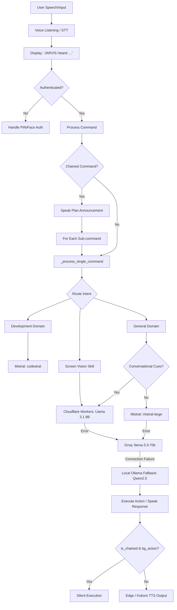

<p align="center">
  
</p>

# 🎙️ JARVIS: AI Voice Assistant & Spatial Gesture OS Controller

<p align="center">
  <strong>A high-performance, private, Stark-inspired desktop companion blending local neural pipelines, spatial computer vision, and serverless LLM scaling to automate your Windows workflow.</strong>
</p>

<p align="center">
  <a href="LICENSE"></a>
  <a href="https://www.python.org/"></a>
  <a href="https://ollama.com/"></a>
  <a href="https://github.com/hexgrad/kokoro"></a>
  <a href="https://github.com/darshitp091/Jarvis"></a>
</p>

---

### 📊 Repository Activity
<p align="center">
  
  
</p>

---

## 📖 About the Project

JARVIS is an advanced **AI voice assistant** and **spatial gesture controller** engineered for privacy-first desktop automation. Operating on a hybrid local-and-cloud architecture, it combines real-time spatial computer vision (webcam hand gestures & eye-gaze tracking), local offline speech-to-text, and a resilient serverless routing brain.

As a complete hands-free computer controller, JARVIS executes operating system actions, manages background media playback, runs parallel web crawler sweeps, compiles notes inside an Obsidian vault, and commands Android phones via an offline ADB mobile bridge.

---

## ⚡ Core Capabilities & Features

### 1. 🗣️ Multilingual Audio & Speech
*   **Zero-Command Transcription:** Displays instant visual CLI feedback (`JARVIS Heard: <text>`).
*   **Bilingual STT:** Transcribes **English, Hindi, and Hinglish** natively without translation constraints.
*   **Neural Speech Synthesis:** Streams natural speech with expressive emotional tags (`[excited]`, `[thoughtful]`, `[sigh]`, `[laugh]`) to control tone, pause inflections, and rate.
*   **Acoustic Interruption:** Automatically stops speaking mid-sentence when you start talking over it.

### 2. 🖐️ Spatial Hand Gesture Control
Control your mouse pointer and applications hands-free via your webcam feed (~30 FPS):
*   **EMA Cursor Smoothing:** Precision finger tracking with Exponential Moving Average filters to eliminate hand tremors.
*   **Click & Scroll Gestures:** Pinch Index + Thumb (Left Click & Drag), Pinch Middle + Thumb (Right Click), Pinch Pinky + Thumb (Double Click), and vertical multi-finger scrolls.
*   **Air Writing Canvas:** Draw neontrails directly on your screen by raising a "Rock-On" gesture.
*   **Window Swiping:** Focus or move active windows, and close applications instantly by holding a closed fist for 1.5 seconds (equipped with protection guards to prevent self-closure).

### 3. 👁️ Eye-Gaze & Fatigue Diagnostics
*   **Contextual Prompts:** Monitors brow furrowing and gaze centering. Prompts to analyze your active code screen if you appear confused for more than 30 seconds.
*   **Sentry Lock:** Auto-locks Windows and suspends camera feed if unauthorized face-peekers are detected behind you.

### 4. 📱 Android ADB Mobile Bridge
Control your mobile phone over an offline USB ADB connection:
*   **System Diagnostics:** Query battery status, toggle flashlight, adjust sound streams, and mute audio.
*   **Multimodal Screen Analysis:** Take screen grabs, pull photos, and describe them utilizing local vision models.
*   **Communications:** Compose SMS messages, launch WhatsApp calls, and query contacts fuzzily.

### 5. 🏛️ Smart Note-Vault & Memory
*   **Conversational Vault:** Dictate raw, unstructured notes. JARVIS uses the LLM to structure, clean, and save them in Obsidian with standard frontmatter headers and descriptive titles.
*   **Episodic Memory Consolidator:** A background scheduler reads raw daily logs, extracts stable user preferences and coding styles, and stores them long-term.

### 6. 🛠️ Self-Healing Autonomy
*   **Sandbox compiler:** When system scripts or api modules crash, an offline sandbox catches the traceback, prompts Llama for code modifications, compiles it inside a sandboxed environment, and patches the file live!

---

## 🏛️ System Architecture

JARVIS uses a dynamic routing system to direct intent commands. It evaluates user queries, matches constraints, and executes fallbacks across cloud APIs and local instances to maintain offline capability.



---

## 🛠️ Built With (Tech Stack)

| Category | Technology / Library | Purpose |
| :--- | :--- | :--- |
| **Core GUI & Orchestration**| Python 3.10+, PyQt6 | Interface layouts, window overlays, and event loop threads |
| **Bilingual Local STT** | `Faster-Whisper` (base) | Real-time speech transcription (English / Hindi / Hinglish) |
| **Neural TTS Engine** | Edge-TTS, Kokoro ONNX | Natural speech generation with Indian & British voice streams |
| **Spatial Computer Vision** | OpenCV, MediaPipe | Face tracking, eye-gaze tracking, and hand landmarks |
| **Main LLM Brain** | Cloudflare Workers AI | Llama-3.1-8B-Instruct (Sub-second low latency general router) |
| **Specialist APIs** | Mistral AI, OfoxAI, Groq | Mistral Large, Codestral (Coding & Development) |
| **Local Model Sandbox** | Ollama | Qwen2.5-Coder-7B, Moondream2 (Offline fallback) |
| **Mobile Integration** | Android Debug Bridge (ADB) | Offline physical device control |
| **Data & Diagnostics** | Matplotlib, SQLite3 | Local trend charting and telemetry KPI databases |

---

## ⚙️ Getting Started

### Prerequisites
*   **OS:** Windows 10 / 11
*   **Python:** v3.10 or v3.11 (Python 3.12 is not recommended due to MediaPipe constraints)
*   **Hardware:** A functional webcam and microphone
*   **Ollama:** Installed and running in the background
*   **Tesseract OCR:** Installed and added to your system `PATH`

### Installation
1.  **Clone the Repository:**
    ```bash
    git clone https://github.com/darshitp091/Jarvis.git
    cd Jarvis
    ```
2.  **Initialize Virtual Environment:**
    ```powershell
    python -m venv jarvis_env
    .\jarvis_env\Scripts\Activate.ps1
    ```
3.  **Fetch Dependencies:**
    ```powershell
    pip install -r requirements.txt
    ```

### Local Model Weights & Player Binaries
1.  **Pull local Ollama Models:**
    ```bash
    ollama pull qwen2.5-coder:7b
    ollama pull moondream:latest
    ```
2.  **Download MPV Player Binary (for free YouTube audio streaming):**
    *   Download the Windows build from [mpv.io](https://mpv.io/).
    *   Create a `bin/` folder in the project root and place `mpv.exe` inside:
        ```text
        Jarvis/
        ├── bin/
        │   └── mpv.exe
        ```
3.  **Setup Kokoro TTS Weights (Optional Local Fallback):**
    *   Download `kokoro-v1.0.onnx` and `voices-v1.0.bin` from [hexgrad/kokoro-onnx](https://github.com/hexgrad/kokoro-onnx).
    *   Place both files directly in the root directory.

### Configuration
1.  Open `config/settings.yaml` and configure your API credentials:
    ```yaml
    groq:
      api_key: "YOUR_GROQ_API_KEY"
    mistral:
      api_key: "YOUR_MISTRAL_API_KEY"
    cloudflare:
      enabled: true
      account_id: "YOUR_CLOUDFLARE_ACCOUNT_ID"
      api_token: "YOUR_CLOUDFLARE_API_TOKEN"
    ```
2.  Configure your Obsidian vault path:
    ```yaml
    obsidian:
      vault_path: "C:\\Users\\<User>\\Documents\\Obsidian Vault"
    ```

---

## ⚡ Usage & Operational Steps

1.  **Start JARVIS Orchestrator:**
    ```powershell
    python main.py
    ```
2.  **Activate Voice Control:** Speak **"Hey JARVIS"** (or customized wake word).
3.  **State your request:**
    *   *Single Action:* "Play some coding music on Spotify."
    *   *Hinglish Chained Action:* "To pehle kaam karo Spotify mein banjatu song bajao, uske baad mere liye quantum physics par presentation banake open kar do."
4.  **Engage Gesture Control:** Raise your hand in front of the webcam. Move your index finger to control the mouse cursor.

---

## 📅 Roadmap & Milestones

*   `[x]` **Phase 1:** Audio STT (Whisper) & Neural Speech Synthesis (Kokoro)
*   `[x]` **Phase 2:** Webcam Hand Gesture Tracking (EMA cursor, drag-and-drop, air-writing)
*   `[x]` **Phase 3:** Stark Transparent HUD widgets (Snipper, Screen Ruler, Screen Recorder)
*   `[x]` **Phase 4:** Mobile ADB physical controller
*   `[x]` **Phase 5:** Cloudflare Workers AI Llama 3.1 8B integration (sub-second query routing)
*   `[x]` **Phase 6:** Conversational Note-Vault (Obsidian structured writing)
*   `[x]` **Phase 7:** Self-Healing exceptions sandbox engine
*   `[x]` **Phase 8:** Multilingual auto-STT & Hinglish Chained command splitter
*   `[ ]` **Phase 9:** Local Voice-to-Voice offline streaming (F5-TTS & Whisper-streaming)
*   `[ ]` **Phase 10:** Multi-agent physical smart home integration

---

## 🤝 Contributing
Contributions are what make the open source community such an amazing place to learn, inspire, and create. Any contributions you make are **greatly appreciated**.

1.  Fork the Project
2.  Create your Feature Branch (`git checkout -b feature/AmazingFeature`)
3.  Commit your Changes (`git commit -m 'Add some AmazingFeature'`)
4.  Push to the Branch (`git push origin feature/AmazingFeature`)
5.  Open a Pull Request

---

## 📄 License & Contact
Distributed under the MIT License. See [LICENSE](LICENSE) for details.

*   **Author Profile:** [darshitp091](https://github.com/darshitp091)
*   **Project Link:** [https://github.com/darshitp091/Jarvis](https://github.com/darshitp091/Jarvis)
