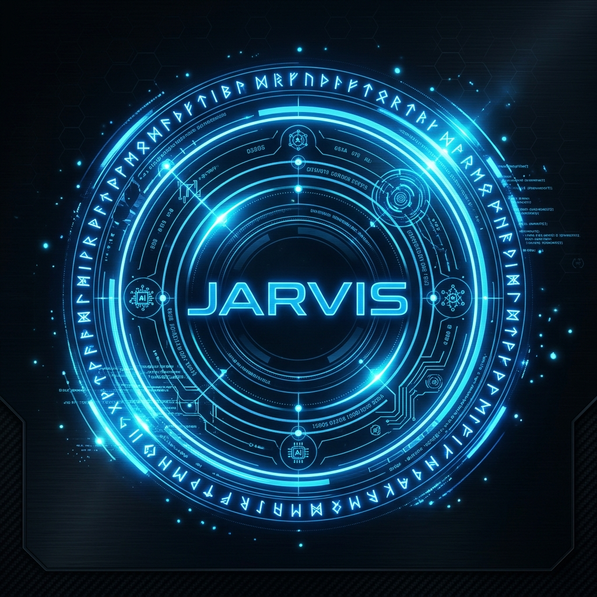
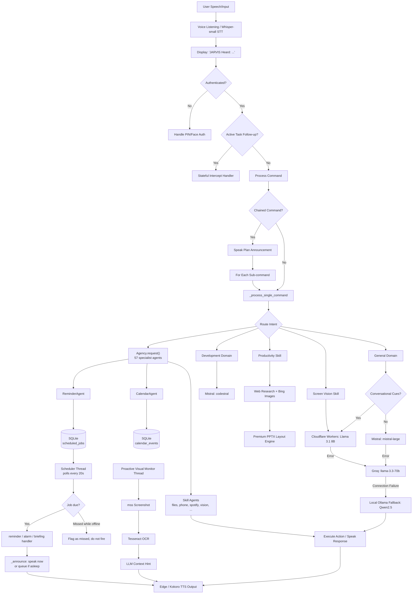

<p align="center">
  
</p>

# 🎙️ JARVIS — AI Voice Assistant & Spatial Gesture OS Controller

<p align="center">
  <strong>A high-performance, privacy-first, Stark-inspired desktop companion blending local neural pipelines, spatial computer vision, serverless LLM scaling, and a proactive visual monitor to fully automate your Windows workflow.</strong>
</p>

<p align="center">
  <a href="https://github.com/darshitp091/Jarvis/actions/workflows/python-app.yml"></a>
  <a href="LICENSE"></a>
  <a href="https://www.python.org/"></a>
  <a href="https://ollama.com/"></a>
  <a href="https://github.com/hexgrad/kokoro"></a>
  <a href="https://github.com/darshitp091/Jarvis"></a>
</p>

<p align="center">
  <a href="SETUP.md"></a>
</p>

---

## 🚀 Installation — Start Here

> **New to Python, or seeing `ModuleNotFoundError`?**
> Read **[SETUP.md](SETUP.md)** — a step-by-step guide written for complete
> beginners, with a fix for every error people actually hit.

### One command installs everything

```powershell
git clone https://github.com/darshitp091/Jarvis.git
cd Jarvis
.\install.ps1
```

That creates the virtual environment, installs all ~51 packages, downloads the
AI models, creates your config file, and verifies the result. Budget 30–45
minutes — almost all of it is just downloads.

### Something not working?

```powershell
python doctor.py
```

It checks every Python package, every external program (FFmpeg, Ollama), the AI
models and your config, then prints the **exact command** to fix whatever is
missing. It uses only the standard library, so it still works when nothing else
is installed.

| Resource | What it gives you |
| :--- | :--- |
| **[SETUP.md](SETUP.md)** | Full beginner walkthrough — 10 steps, plus every common error and its fix |
| **`install.ps1`** | One-command automated installer (safe to re-run) |
| **`doctor.py`** | Tells you what is missing and exactly how to fix it |

**Requirements:** Windows 10/11 · Python 3.10–3.12 (**not 3.13**) · FFmpeg ·
Ollama · webcam + microphone · ~15 GB free space

---

### 📊 Project Metrics & Architecture Highlights

| Core Layer | Primary Engine | Status / Connectivity |
| :--- | :--- | :--- |
| 🧠 **Orchestrator** | PyQt6 Multi-threading | Local Event Loop |
| 🐝 **Agent Swarm** | 57 specialist agents + message broker | Local (sync + background pool) |
| 🗣️ **Speech Engine** | Whisper-small (fine-tuned Hinglish) + Edge-TTS | Hybrid (Auto Fallback) |
| 🖐️ **Vision Sensor** | MediaPipe & OpenCV | Local (30 FPS Webcam Feed) |
| 👁️ **Proactive Monitor** | ScreenVision + Tesseract OCR | Background Loop (Always-On) |
| ⏰ **Reminders & Calendar** | SQLite scheduler + Hinglish time parser | Local, survives restarts |
| ☁️ **Serverless Router** | Cloudflare Workers (Llama 3.1 8B) | Active / Connected |
| 📂 **Workspace Database** | SQLite3 & Obsidian API | Local Vault Synchronized |
| 📊 **Presentation Engine** | python-pptx + Bing Image Scraper | Online Research + Layout |
| ✅ **Test Suite** | pytest (154 headless tests) | No mic, camera, or API keys needed |

---

## 📖 About the Project

JARVIS is an advanced **AI voice assistant** and **spatial gesture controller** engineered for privacy-first desktop automation. Operating on a hybrid local-and-cloud architecture, it combines real-time spatial computer vision (webcam hand gestures & eye-gaze tracking), bilingual Hinglish speech-to-text (powered by a locally fine-tuned Whisper-small model), a resilient serverless LLM routing brain, and a continuously running proactive screen monitor.

As a complete hands-free computer controller, JARVIS executes operating system actions, manages background media playback, runs parallel web crawler sweeps, researches topics online and compiles professional presentations, stores notes inside an Obsidian vault, and commands Android phones via an offline ADB mobile bridge — all through natural Hinglish voice commands.

---

## 🧩 What Can JARVIS Do? (Quick Reference)

> Speak naturally in **English or Hinglish** — JARVIS understands both.

### 🗣️ Voice & Speech
- 🎙️ Transcribe your speech in real-time (English, Hindi, Hinglish)
- 🔊 Speak back in a natural Indian-accented voice (Edge-TTS / Kokoro)
- 🚀 Execute **chained commands** — _"pehle yeh karo, phir woh karo"_
- 🛑 Stop speaking immediately when you interrupt it
- 🌐 Switch seamlessly between English and Hinglish mid-sentence

### 💻 Windows OS Control
- 🗂️ Open, close, move, resize, and switch between application windows
- 📋 Copy, paste, type, and control the clipboard
- 🔍 Search files and folders across your drive
- 📸 Take screenshots and screen recordings
- 🔒 Lock your PC, put it to sleep, or restart it
- ⌨️ Run any terminal/PowerShell command via voice
- 📐 Launch the screen ruler, snipper tool, and HUD overlays

### 🖐️ Gesture & Vision Control
- 🖱️ Control the mouse cursor with your index finger (webcam-only, no touch)
- 👆 Left click, right click, double click, and drag via pinch gestures
- 📜 Scroll pages up/down with multi-finger swipes
- ✍️ Draw neon air-writing trails on the screen with a Rock-On gesture
- 🪟 Swipe windows to move them; hold a fist to close an app instantly
- 👁️ Auto-detect if you look confused for 30s and offer to analyze your screen

### 📊 Presentations & Productivity
- 📝 Create a professional PowerPoint presentation on **any topic via voice**
- 🌐 Research the topic **online** before generating slides (real content, not hallucinated)
- 🖼️ Automatically download and embed **relevant images** into each slide
- 🎨 Apply premium design themes (Midnight Cyberpunk, Stark Tech, Forest Minimalist, etc.)
- 👤 Add a branded **"Presented by [Your Name]"** cover slide
- ✏️ Edit a specific slide by saying _"slide 3 ki image badlo"_ — no slide number needed, JARVIS detects it visually
- ✅ Confirm completion with _"sahi hai"_ / _"done"_ — JARVIS remembers and clears the task

### 🎵 Music & Media
- 🎶 Play any song, artist, or playlist on **Spotify** via voice
- ▶️ Stream free YouTube audio via **MPV** (no browser needed)
- ⏸️ Pause, resume, skip, and control volume hands-free
- 📻 Search and play any genre — _"lofi music laga do"_, _"EDM bajao"_

### 🔍 Research & Web
- 🌍 Search Google / DuckDuckGo / Bing for any topic
- 📰 Summarize news, articles, and web pages in Hinglish
- 💹 Get live stock/crypto prices and market trends
- 🛒 Compare products and food items with pros/cons

### ⏰ Reminders, Alarms & Calendar
- ⏱️ Set reminders in natural Hinglish — _"remind me to call mom at 6 pm"_, _"yaad dila do 20 minutes mein"_
- 🔔 Set alarms — _"set an alarm for 7 am"_, _"wake me up at 6"_
- 🔁 Recurring reminders — _"remind me to stretch every day at 5 pm"_
- 📋 List, cancel, or snooze — _"what are my reminders"_, _"cancel all reminders"_, _"snooze 15 minutes"_
- 💾 Everything persists in SQLite, so reminders **survive a restart or shutdown**
- ⚠️ A job that came due while JARVIS was closed is flagged as missed rather than fired late unexpectedly
- 🗓️ Schedule events — _"schedule a meeting with Roshan tomorrow at 4 pm"_
- 📅 Read your day — _"what's on my agenda today"_, _"next meeting"_
- ⚡ Spot double-bookings and find gaps — _"any conflicts?"_, _"am I free for 60 minutes tomorrow"_
- 📤 Import and export standard `.ics` files, so no cloud account or credentials are needed

### 📔 Notes & Memory
- 📝 Dictate raw notes — JARVIS structures and saves them in **Obsidian** automatically
- 🧠 Remember your preferences, coding style, and past tasks across sessions
- 🗓️ Track active tasks in memory and route follow-up commands intelligently
- 🔁 Recall what it was doing after a restart using persistent state files

### 📱 Android Phone Control (via USB/ADB)
- 🔋 Check battery, toggle flashlight, adjust volume on your phone
- 📷 Take a phone screenshot and describe what's on screen
- 💬 Send SMS messages and launch WhatsApp calls via voice
- 📂 Pull photos and files from your phone to your PC

### 👁️ Proactive Screen Monitor
- 🖥️ Watch your screen in the background every ~30 seconds (always-on)
- 💡 Proactively suggest tips based on what app is open (VS Code, browser, etc.)
- 🚨 Spot error messages on-screen and offer to fix them — without being asked
- 🔐 Lock your PC if an unknown face is detected looking at your screen

### 🛠️ Developer & Self-Healing Tools
- 🧑‍💻 Ask JARVIS to write, run, or debug code in any language
- 🔧 Auto-patch itself if a module crashes — catches the traceback and fixes the code live
- 📦 Git commit, push, and manage repositories via voice
- 🔎 Audit your codebase for security vulnerabilities
- 📊 Generate charts and graphs from local data files

---

## ⚡ Core Capabilities & Features

### 1. 🗣️ Multilingual Audio & Speech (Hinglish-First)
- **Zero-Command Transcription:** Displays instant visual CLI feedback (`JARVIS Heard: <text>`).
- **Fine-Tuned Hinglish STT:** Whisper-small fine-tuned locally on the `agarwalayushi/hinglish` dataset (2,200+ hours of Hindi, English & Romanized Hinglish speech). Handles natural code-mixed Hinglish seamlessly.
- **Hybrid Hinglish Wake Engine:** Listens for natural Hinglish wake phrases (`"jarvis"`, `"jarvis bhai"`, `"sun jarvis"`, `"chalo utho jarvis"`, `"jarvis ji"`, `"hey jarvis"`). Includes interactive enrollment tool (`record_hinglish_wakeword.py`).
- **Adaptive Speaker Verification (`0.62` Threshold):** Compares owner voice MFCC profiles against enrolled profile. Features dynamic thresholding (`0.62` default, `0.55` music active) and continuous voice print adaptation.
- **6-Minute Active Wake Lock (`360s`):** Maintains active conversational state when music is paused, preventing JARVIS from prematurely falling asleep every 5 seconds.
- **ONNX Silero VAD:** Lightweight, CPU-friendly Voice Activity Detection using ONNX-exported Silero VAD — prevents false triggers and ensures clean segmentation.
- **Chained Command Splitter:** Understands multi-step Hinglish commands like _"pehle yeh karo, phir woh karo"_ and executes each sub-task in sequence.
- **Neural Speech Synthesis:** Streams natural Kokoro or Edge-TTS speech with expressive emotional tags (`[excited]`, `[thoughtful]`, `[sigh]`, `[laugh]`) to control tone, pause inflections, and rate.
- **Acoustic Interruption:** Automatically stops speaking mid-sentence when you start talking over it.

### 2. 💬 Proactive WhatsApp & Mobile Notification Engine
- **Personal Contact Filter:** Filters out group chats, corporate alerts (swiggy, bank alerts), and OTPs, notifying you only of personal contacts.
- **Real-Time Spoken Announcements:** When awake, JARVIS announces incoming personal WhatsApp messages immediately: *"Sir, Roshan ka WhatsApp message aaya hai... Kya reply bhej doon?"*
- **Quiet Asleep Queue:** When sleeping, messages queue silently in `unread_whatsapp_messages` without interrupting your sleep, announcing a subtle notice upon wake-up.
- **WhatsApp Desktop Direct Reply:** Automatically opens WhatsApp Desktop deep-links (`whatsapp://send?...`) and types your voice replies directly.

### 3. 📊 Professional Presentation Generator (Research-Driven)
- **Online Content Research:** Crawls Google/DuckDuckGo/Bing for the requested topic, summarizes research into a bilingual Hinglish LLM outline before generating any slides.
- **Intelligent Slide Layout Engine:** Generates premium side-by-side slide layouts: bullet-point text column (left) with a contextually-matched downloaded image (right). Falls back to full-width text if no image is found.
- **Bing Image Scraper:** Queries Bing Images per slide, decodes HTML entities to extract high-res image URLs, downloads and validates them with PIL before embedding.
- **Custom Themes:** Supports multiple design themes — `midnight_cyberpunk`, `stark_tech`, `light_professional`, and `forest_minimalist` — with curated color palettes and typography.
- **Branded Cover Slide:** Automatically generates a styled cover slide with title, subtitle, and "Presented by [Name]".
- **Stateful Human-in-the-Loop:** After generating the PPTX, JARVIS asks if you're happy with it. Say _"sahi hai"_ / _"done"_ → it confirms and clears the topic from active memory. Say _"slide 3 ki image badlo"_ → it vision-detects the active slide, updates only that slide, and rebuilds.
- **Vision-Based Active Slide Detection:** Uses `ScreenVision` to screenshot and OCR the currently open PowerPoint slide to determine which slide to modify — no need to say the slide number.
- **State Persistence:** Saves full presentation metadata to `config/last_presentation.json` to enable follow-up edits even after JARVIS restarts.

### 4. 👁️ Proactive Visual Assistant (Always-On Screen Monitor)
- **Continuous Background Loop:** A dedicated background thread (`_visual_assistant_loop`) captures screenshots every ~30 seconds using `mss`.
- **App-Aware Context Engine:** Identifies the active window/application and tailors its suggestions accordingly — coding tips while in VS Code, productivity hints in a browser, etc.
- **OCR Text Extraction:** Extracts on-screen text via Tesseract OCR and passes it as context to the LLM for intelligent, relevant suggestions.
- **Proactive Voice Prompts:** If JARVIS notices something interesting (error message on screen, long YouTube video paused, etc.) it proactively speaks a helpful, contextual suggestion — without being asked.
- **Non-Blocking Design:** Runs entirely on a separate daemon thread; never blocks voice listening or command execution.

### 5. 🖐️ Spatial Hand Gesture Control
Control your mouse pointer and applications hands-free via your webcam feed (~30 FPS):
- **EMA Cursor Smoothing:** Precision finger tracking with Exponential Moving Average filters to eliminate hand tremors.
- **Click & Scroll Gestures:** Pinch Index + Thumb (Left Click & Drag), Pinch Middle + Thumb (Right Click), Pinch Pinky + Thumb (Double Click), and vertical multi-finger scrolls.
- **Air Writing Canvas:** Draw neon trails directly on your screen by raising a "Rock-On" gesture.
- **Window Swiping:** Focus or move active windows, and close applications instantly by holding a closed fist for 1.5 seconds (equipped with protection guards to prevent self-closure).

### 6. 👁️ Eye-Gaze & Fatigue Diagnostics
- **Contextual Prompts:** Monitors brow furrowing and gaze centering. Prompts to analyze your active code screen if you appear confused for more than 30 seconds.
- **Sentry Lock:** Auto-locks Windows and suspends camera feed if unauthorized face-peekers are detected behind you.

### 7. 📱 Android ADB Mobile Bridge
Control your mobile phone over an offline USB ADB connection:
- **System Diagnostics:** Query battery status, toggle flashlight, adjust sound streams, and mute audio.
- **Multimodal Screen Analysis:** Take screen grabs, pull photos, and describe them utilizing local vision models.
- **Communications:** Compose SMS messages, launch WhatsApp calls, and query contacts fuzzily.

### 8. 🏛️ Smart Note-Vault & Memory
- **Conversational Vault:** Dictate raw, unstructured notes. JARVIS uses the LLM to structure, clean, and save them in Obsidian with standard frontmatter headers and descriptive titles.
- **Episodic Memory Consolidator:** A background scheduler reads raw daily logs, extracts stable user preferences and coding styles, and stores them long-term.
- **Stateful Conversation Tracking:** JARVIS tracks active tasks in memory (e.g., presentation topic, last file opened) and routes follow-up commands to the right skill automatically — no need to repeat context.

### 9. ⏰ Persistent Reminders, Alarms & Local Calendar
A local-first scheduling layer backed by SQLite. No cloud account, no API key, and no network dependency.

- **Hinglish Time Parser (`services/timeparse.py`):** Resolves natural phrasing into a concrete datetime plus a recurrence rule — _"at 6 pm"_, _"in 20 minutes"_, _"kal subah"_, _"every day at 5 pm"_. Returns the remaining subject separately, so _"remind me to call mom at 6 pm"_ stores the task as `call mom`.
- **Asks Instead of Guessing:** When no time phrase is present, JARVIS asks for one rather than inventing a default and silently scheduling the wrong thing.
- **Vague Time Acknowledgement:** If the hour was inferred rather than stated, JARVIS reads the assumption back so it can be corrected immediately.
- **Persistent Scheduler (`services/scheduler.py`):** A background thread polls SQLite for due jobs. Reminders, alarms, and recurring briefings survive restarts and full shutdowns.
- **Misfire Grace Window:** A job that came due while JARVIS was closed fires on the next start only if it is within the grace window (120 minutes by default); anything older is flagged as `missed` instead of firing unexpectedly late.
- **Fault Isolation:** A handler that raises is recorded against its own job and never kills the scheduler thread.
- **Unambiguous Cancellation:** With one reminder pending, _"cancel reminder"_ just works. With several, JARVIS asks which number rather than guessing.
- **Local Calendar (`services/calendar_service.py`):** Agenda briefings, next event, overlap detection, and free-slot search across a working day. All timestamps are stored in UTC and converted to your configured timezone for display.
- **Standard ICS Interchange:** Import and export plain `.ics` files, so events move between JARVIS and any calendar product without credentials.
- **Thread-Safe Store (`services/db.py`):** WAL-mode SQLite so the voice thread, scheduler thread, and proactive monitor can read and write concurrently without blocking each other.

### 10. 🐝 Multi-Agent Swarm & Message Broker
JARVIS routes every voice intent through a swarm of **57 specialist agents**, each owning the action logic for exactly one capability. The `Agency` broker in `core/agency.py` is the single dispatch point.

- **One source of truth:** each capability's logic lives in its agent, not duplicated across the orchestrator, so a fix cannot land in one copy and miss another.
- **Synchronous requests:** `Agency.request()` returns the agent's response string so JARVIS can speak it. It runs **inline on the calling thread**, because handlers touch PyQt widgets and Qt requires that from the owning thread. Running inline also means a handler that itself calls `request()` cannot deadlock on an exhausted pool.
- **Background dispatch:** `Agency.send_message()` submits to a 16-worker thread pool for proactive work nobody is waiting on. Failures there are logged, never raised, so a failing background agent cannot take down its caller.
- **Loud failures:** the base `Agent.receive_message` raises `NotImplementedError`. An unimplemented agent fails visibly instead of silently doing nothing.
- **Traceback fidelity:** `request()` lets exceptions propagate, so the existing retry and self-healing loop still receives the original traceback.
- **Registered by class:** agents register via `agent_cls.__name__`, so the broker key can never drift away from the class name.

### 11. 🛠️ Codestral & LLM Self-Healing Sensory Loop
- **Active Crash Diagnostics:** Logs full stack tracebacks to `config/crash_diagnostics.json` whenever an unexpected runtime error occurs.
- **Dynamic Hotpatching:** Instantly patches missing attributes, PyAudio stream drops, and parameter mismatches without crashing the application.
- **Mistral / Codestral Diagnosis:** Calls Codestral / Mistral LLM to analyze stack traces and speak a concise Hinglish diagnosis and recovery briefing.
- **Loop-Storm Safeguard:** Monitors error rates over 30-second windows and resets sensory subsystems automatically if an error loop occurs, preventing infinite repeating speech error loops.

---

## 🏛️ System Architecture

JARVIS uses a dynamic routing system to direct intent commands. It evaluates user queries, matches constraints, and executes fallbacks across cloud APIs and local instances to maintain offline capability.


```mermaid
graph TD
    User[User Speech/Input] --> Listen[Voice Listening / Whisper-small STT]
    Listen --> Display["Display: 'JARVIS Heard: ...'"]
    Display --> Auth{Authenticated?}
    Auth -- No --> HandleAuth[Handle PIN/Face Auth]
    Auth -- Yes --> Confirm{Active Task Follow-up?}
    Confirm -- Yes --> Intercept[Stateful Intercept Handler]
    Confirm -- No --> Process[Process Command]
    Process --> Chained{Chained Command?}
    Chained -- Yes --> Plan[Speak Plan Announcement]
    Plan --> Loop[For Each Sub-command]
    Loop --> Single[_process_single_command]
    Chained -- No --> Single
    Single --> Route{Route Intent}

    %% Agent swarm dispatch
    Route --> Agency["Agency.request()<br/>57 specialist agents"]
    Agency --> RemAgent[ReminderAgent] --> Sched[(SQLite<br/>scheduled_jobs)]
    Agency --> CalAgent[CalendarAgent] --> Cal[(SQLite<br/>calendar_events)]
    Agency --> SkillAgents[Skill Agents<br/>files, phone, spotify, vision, ...]
    SkillAgents --> Exec[Execute Action / Speak Response]

    Route --> Dev[Development Domain] --> Codestral[Mistral: codestral]
    Route --> Pres[Productivity Skill] --> ResearchCrawl[Web Research + Bing Images]
    ResearchCrawl --> PptxEngine[Premium PPTX Layout Engine]
    Route --> Vis[Screen Vision Skill] --> Cloudflare[Cloudflare Workers: Llama 3.1 8B]
    Route --> Gen[General Domain] --> Conv{Conversational Cues?}
    Conv -- Yes --> Cloudflare
    Conv -- No --> MistralLarge[Mistral: mistral-large]

    %% Fallback Tree
    Cloudflare -- Error --> Groq[Groq: llama-3.3-70b]
    MistralLarge -- Error --> Groq
    Groq -- Connection Failure --> Ollama[Local Ollama Fallback: Qwen2.5]
    Ollama --> Exec
    Exec --> TTS[Edge / Kokoro TTS Output]

    %% Proactive Loop
    BgLoop[Proactive Visual Monitor Thread] --> Screenshot[mss Screenshot]
    Screenshot --> OCR[Tesseract OCR]
    OCR --> LLM_Hint[LLM Context Hint]
    LLM_Hint --> TTS

    %% Scheduler thread fires independently of voice
    SchedLoop[Scheduler Thread<br/>polls every 20s] --> Due{Job due?}
    Due -- Yes --> Fire[reminder / alarm / briefing handler]
    Due -- Missed while offline --> Flag[Flag as missed, do not fire]
    Fire --> Announce[_announce: speak now<br/>or queue if asleep]
    Announce --> TTS
    Sched --> SchedLoop
```

---

## 🛠️ Built With (Tech Stack)

| Category | Technology / Library | Purpose |
| :--- | :--- | :--- |
| **Core GUI & Orchestration** | Python 3.10-3.12, PyQt6 | Interface layouts, window overlays, and event loop threads |
| **Bilingual Hinglish STT** | `faster-whisper` (whisper-small fine-tuned) | Real-time Hinglish/English/Hindi transcription with ONNX Silero VAD |
| **Neural TTS Engine** | Edge-TTS, Kokoro ONNX | Natural speech generation with Indian & British voice streams |
| **Spatial Computer Vision** | OpenCV, MediaPipe | Face tracking, eye-gaze tracking, and hand landmarks |
| **Proactive Monitor** | `mss`, Tesseract OCR | Always-on background screen capture & OCR suggestion engine |
| **Presentation Generator** | python-pptx, Bing Scraper, PIL | Online-researched, image-enriched professional PPTX creation |
| **Main LLM Brain** | Cloudflare Workers AI | Llama-3.1-8B-Instruct (sub-second low latency general router) |
| **Specialist APIs** | Mistral AI, OfoxAI, Groq | Mistral Large, Codestral (Coding & Development) |
| **Local Model Sandbox** | Ollama | Qwen2.5-Coder-7B, Moondream2 (Offline fallback) |
| **Whisper Fine-Tuning** | HuggingFace Transformers, Adafactor | Local fine-tune of Whisper-small on Hinglish dataset |
| **Mobile Integration** | Android Debug Bridge (ADB) | Offline physical device control |
| **Agent Swarm** | `concurrent.futures` ThreadPoolExecutor | 57 specialist agents behind a single message broker |
| **Scheduling & Calendar** | SQLite3 (WAL mode), `zoneinfo` | Persistent reminders, alarms, events, and ICS interchange |
| **Testing** | pytest | 154 headless tests, no hardware or API keys required |
| **Data & Diagnostics** | Matplotlib, SQLite3 | Local trend charting and telemetry KPI databases |

---

## ⚙️ Getting Started

> **Beginner?** Use **[SETUP.md](SETUP.md)** or just run `.\install.ps1` —
> see [Installation](#-installation-start-here) at the top.
> The steps below are the manual equivalent.

### Prerequisites
- **OS:** Windows 10 / 11
- **Python:** 3.10, 3.11 or 3.12. **Not 3.13** — mediapipe and torch have no
  3.13 wheels yet, so installation fails with confusing compiler errors.
- **Hardware:** A functional webcam and microphone
- **FFmpeg:** Required. Without it JARVIS cannot speak at all (`winget install Gyan.FFmpeg`)
- **Ollama:** Installed and running in the background
- **Tesseract OCR:** Optional, improves reading text on screen

### Installation
1. **Clone the Repository:**
   ```bash
   git clone https://github.com/darshitp091/Jarvis.git
   cd Jarvis
   ```
2. **Initialize Virtual Environment:**
   ```powershell
   python -m venv jarvis_env
   .\jarvis_env\Scripts\Activate.ps1
   ```
   If PowerShell blocks the script, run this once:
   `Set-ExecutionPolicy -Scope CurrentUser -ExecutionPolicy RemoteSigned`
3. **Fetch Dependencies:**
   ```powershell
   pip install -r requirements.txt
   ```
4. **Create your config file** — *do not skip this, it is the most common
   cause of a startup crash:*
   ```powershell
   copy config\settings.yaml.example config\settings.yaml
   ```
   API keys inside are optional. Leave them blank and those specific features
   stay switched off; everything else still works.
5. **Verify before launching:**
   ```powershell
   python doctor.py
   ```

### Local Model Weights & Player Binaries
1. **Pull local Ollama Models:**
   ```bash
   ollama pull qwen2.5-coder:7b
   ollama pull moondream:latest
   ollama pull nomic-embed-text:latest
   ```
2. **Download MPV Player Binary (for free YouTube audio streaming):**
   - Download the Windows build from [mpv.io](https://mpv.io/).
   - Create a `bin/` folder in the project root and place `mpv.exe` inside:
     ```
     Jarvis/
     ├── bin/
     │   └── mpv.exe
     ```
3. **Setup Kokoro TTS Weights (Optional Local Fallback):**
   - Download `kokoro-v1.0.onnx` and `voices-v1.0.bin` from [hexgrad/kokoro-onnx](https://github.com/hexgrad/kokoro-onnx).
   - Place both files directly in the root directory.

4. **Fine-Tuned Whisper Hinglish STT (Optional, Recommended):**
   - A locally fine-tuned `whisper-small` model checkpoint is included in the `whisper-small-hinglish-finetuned/` directory.
   - The fine-tuning script is available at `scratch/fine_tune_whisper_hinglish.py` using the `agarwalayushi/hinglish` HuggingFace dataset.
   - If you want to re-fine-tune from scratch:
     ```powershell
     python scratch/fine_tune_whisper_hinglish.py
     ```

### Configuration

`config/settings.yaml` holds real credentials and is **gitignored**, exactly like a `.env` file. The repository tracks `config/settings.yaml.example` as the template. Never commit the real file.

1. **Create your config from the template:**
   ```powershell
   Copy-Item config\settings.yaml.example config\settings.yaml
   ```
2. Open `config/settings.yaml` and fill in your API credentials:
   ```yaml
   groq:
     api_key: "YOUR_GROQ_API_KEY"
   mistral:
     api_key: "YOUR_MISTRAL_API_KEY"
   cloudflare:
     enabled: true
     account_id: "YOUR_CLOUDFLARE_ACCOUNT_ID"
     api_token: "YOUR_CLOUDFLARE_API_TOKEN"
   ```
   > JARVIS runs fully offline with these left blank, falling back to local Ollama models.
3. Configure your Obsidian vault path:
   ```yaml
   obsidian:
     vault_path: "C:\\Users\\<User>\\Documents\\Obsidian Vault"
   ```
4. Set your timezone so spoken times resolve correctly:
   ```yaml
   scheduler:
     enabled: true
     poll_interval: 20          # seconds between due-job checks
     misfire_grace_minutes: 120 # how late a missed job may still fire
   calendar:
     enabled: true
     timezone: Asia/Kolkata     # IANA name; must match your local clock
   ```
   > The `calendar.timezone` value converts spoken wall-clock times into the UTC timestamps stored in SQLite. If it does not match your actual local timezone, reminders will fire at the wrong hour.

5. **If you add a new setting**, add it to `config/settings.yaml.example` too (with a placeholder, never a real key) so the template stays complete.

---

## 🧪 Running the Tests

The suite is fully headless — no microphone, camera, GPU, or API key required.

```powershell
.\jarvis_env\Scripts\Activate.ps1
pytest
```

Expect **118 passing tests** in a few seconds. Coverage focuses on the logic that can be verified without hardware:

| Test file | Tests | Covers |
| :--- | :--- | :--- |
| `tests/test_agents.py` | 46 | Agent broker semantics, reminders, calendar, skill delegation, and router/dispatch coverage guards |
| `tests/test_services.py` | 33 | SQLite store, scheduler recurrence and misfire behaviour, calendar queries |
| `tests/test_timeparse.py` | 39 | Hinglish and English time phrase parsing |

Two guards are worth knowing about, because they protect against silent breakage rather than crashes:

- `test_every_router_skill_has_a_handler` asserts every skill `intent_router` can emit has a matching dispatch branch in `main.py`. Without it, a routed intent falls through to the chat LLM, which replies as if it succeeded while doing nothing.
- `test_agents_module_has_no_logging_only_handlers` fails if any agent regresses into a log-only stub that accepts a message and silently discards it.

> `pytest.ini` pins collection to `tests/`. Without it, a bare `pytest` at the repo root also collects `scratch/test_*.py`, which import `main.py` and open the microphone and camera, making the run appear to hang.

---

## ⚡ Usage & Operational Steps

1. **Start JARVIS Orchestrator:**
   ```powershell
   python main.py
   ```
2. **Activate Voice Control:** Speak **"Hey JARVIS"** (or your customized wake word).
3. **State your request in Hinglish or English:**
   - *Presentation:* `"Quantum physics par 12 slide ka presentation banado presented by Darshit"`
   - *Chained Action:* `"Pehle Spotify mein lofi music bajao, phir quantum physics ka presentation kholo"`
   - *Follow-up:* `"Slide 5 ki image badlo"` or `"Sahi hai, done kar do"`
   - *Music:* `"Play some coding music on Spotify."`
   - *Reminder:* `"Remind me to call mom at 6 pm"` or `"Yaad dila do 20 minutes mein paani peena hai"`
   - *Alarm:* `"Set an alarm for 7 am"`
   - *Recurring:* `"Remind me to stretch every day at 5 pm"`
   - *Calendar:* `"Schedule a meeting with Roshan tomorrow at 4 pm"`
   - *Agenda:* `"What's on my agenda today"` or `"Next meeting"`
   - *Review reminders:* `"What are my reminders"`, `"Cancel all reminders"`, `"Snooze 15 minutes"`
4. **Engage Gesture Control:** Raise your hand in front of the webcam. Move your index finger to control the mouse cursor.
5. **Proactive Monitor:** JARVIS continuously watches your screen and will proactively suggest relevant tips without being asked.

---

## 📂 Project Structure

```
Jarvis/
├── core/                        # Core engine modules (20 files)
│   ├── intent_router.py         # Hinglish intent router & parameter extractor
│   ├── agency.py                # Agent message broker (sync request + background pool)
│   ├── agents.py                # 57 specialist agents owning per-skill action logic
│   ├── audio_engine.py          # STT pipeline (Whisper + ONNX Silero VAD)
│   ├── tts_engine.py            # Kokoro ONNX TTS engine
│   ├── wake_word.py             # Wake word detector
│   ├── proactive_monitor.py     # Always-on screen screenshot & suggestion loop
│   ├── brain.py                 # Memory, episodic logs & context manager
│   └── vision_engine.py         # ScreenVision OCR & active window reader
├── services/                    # Local-first service layer (SQLite backed)
│   ├── db.py                    # WAL-mode SQLite store, migrations & audit log
│   ├── scheduler.py             # Persistent reminders/alarms with misfire handling
│   ├── calendar_service.py      # Events, conflicts, free slots, ICS import/export
│   └── timeparse.py             # Hinglish/English time & recurrence parser
├── skills/                      # Capability modules (33 files)
│   ├── productivity.py          # Professional Presentation Generator (PPTX)
│   ├── spotify_control.py       # Spotify API music controller
│   ├── os_control.py            # Windows OS automation & file operations
│   ├── file_manager.py          # File/folder operations, purge, sync, backup
│   ├── web_research.py          # Headless web crawler & summarizer
│   ├── phone_controller.py      # Android ADB mobile bridge
│   ├── gesture_control.py       # MediaPipe hand gesture controller
│   ├── obsidian_control.py      # Obsidian vault note writer
│   ├── market_analyzer.py       # Stock/crypto market analyzer
│   ├── youtube_music.py         # YouTube audio streaming via MPV
│   └── screen_vision.py         # LLM-powered screen analysis skill
├── domains/                     # Domain expert prompt routers (7 files)
├── tests/                       # 154 headless tests (no hardware needed)
│   ├── test_agents.py           # Broker, reminders, calendar, dispatch guards
│   ├── test_services.py         # DB, scheduler recurrence & misfire, calendar
│   └── test_timeparse.py        # Hinglish/English time phrase parsing
├── scratch/                     # Local experiments (gitignored)
│   └── fine_tune_whisper_hinglish.py  # Whisper-small Hinglish fine-tuning script
├── whisper-small-hinglish-finetuned/  # Fine-tuned model checkpoint
├── config/
│   ├── settings.yaml.example    # Tracked template — copy this to settings.yaml
│   ├── settings.yaml            # Your real API keys (GITIGNORED, never commit)
│   ├── productivity.db          # SQLite: jobs, events, todos, audit trail
│   └── last_presentation.json   # Active presentation state (for follow-up edits)
├── ui/                          # PyQt6 GUI overlays & widgets (9 files)
├── assets/                      # Logos, icons, and static assets
├── main.py                      # Main JARVIS orchestrator
├── pytest.ini                   # Pins test collection to tests/
└── requirements.txt
```

---

## 📅 Roadmap & Milestones

- `[x]` **Phase 1:** Audio STT (Whisper) & Neural Speech Synthesis (Kokoro)
- `[x]` **Phase 2:** Webcam Hand Gesture Tracking (EMA cursor, drag-and-drop, air-writing)
- `[x]` **Phase 3:** Stark Transparent HUD widgets (Snipper, Screen Ruler, Screen Recorder)
- `[x]` **Phase 4:** Mobile ADB physical controller
- `[x]` **Phase 5:** Cloudflare Workers AI Llama 3.1 8B integration (sub-second query routing)
- `[x]` **Phase 6:** Conversational Note-Vault (Obsidian structured writing)
- `[x]` **Phase 7:** Self-Healing exceptions sandbox engine
- `[x]` **Phase 8:** Multilingual auto-STT & Hinglish Chained command splitter
- `[x]` **Phase 9:** Local Whisper-small fine-tuned on Hinglish dataset (2,200+ hrs)
- `[x]` **Phase 10:** Research-driven Professional Presentation Generator with Bing image scraping, premium PPTX themes, and vision-based slide editing
- `[x]` **Phase 11:** Always-on Proactive Visual Monitor (background screenshot + OCR + LLM suggestions)
- `[x]` **Phase 12:** Stateful Conversation Memory & Topic Tracking (follow-up intents, finalization confirmation)
- `[x]` **Phase 13:** Local-first service layer — WAL-mode SQLite store, persistent scheduler with misfire handling, calendar with ICS interchange, and a Hinglish time/recurrence parser
- `[x]` **Phase 14:** Multi-agent swarm made functional — 57 specialist agents behind a message broker with synchronous request/response, plus voice-reachable reminders, alarms, and calendar
- `[x]` **Phase 15:** Headless test suite (118 tests) with router-to-dispatch coverage guards that fail the build when an intent would silently fall through
- `[ ]` **Phase 16:** Local Voice-to-Voice offline streaming (F5-TTS & Whisper-streaming)
- `[ ]` **Phase 17:** Physical smart home integration over local MQTT
- `[ ]` **Phase 18:** Extend test coverage to `intent_router` regex rules and the `main.py` dispatch bodies

---

## 🤝 Contributing
Contributions are what make the open source community such an amazing place to learn, inspire, and create. Any contributions you make are **greatly appreciated**.

1. Fork the Project
2. Create your Feature Branch (`git checkout -b feature/AmazingFeature`)
3. Run `pytest` and make sure all 118 tests still pass
4. Commit your Changes (`git commit -m 'Add some AmazingFeature'`)
5. Push to the Branch (`git push origin feature/AmazingFeature`)
6. Open a Pull Request

**When adding a new skill or intent:**
- Give the capability an agent in `core/agents.py` and add a dispatch branch in `main.py`. `test_every_router_skill_has_a_handler` fails if a router intent has nowhere to go.
- Never commit `config/settings.yaml`. Add any new setting to `config/settings.yaml.example` with a placeholder value.

---

## 📄 License & Contact
Distributed under the MIT License. See [LICENSE](LICENSE) for details.

- **Author Profile:** [darshitp091](https://github.com/darshitp091)
- **Project Link:** [https://github.com/darshitp091/Jarvis](https://github.com/darshitp091/Jarvis)
